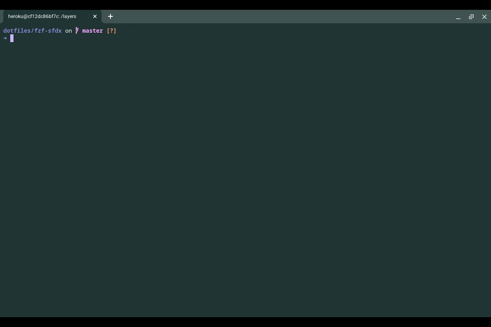

## Supercharge your Salesforce CLI game with FZF!

Fuzzy find Salesforce CLI commands and flags as you type, with live previews of what each command and flag does. No more typos, switching to the browser or running `help` to lookup commands and associated options. Autocomplete doesn't get any better than this!

See it in action below

#### Pre-Requisites
- [FZF](https://github.com/junegunn/fzf)
(If you use the command line in any capacity, do yourself and favor and install fzf. Seriously, even if you don't plan 
on using this sfdx script, install FZF. It will change your life.)
- [jq](https://stedolan.github.io/jq/download/)
- [Salesforce CLI](https://developer.salesforce.com/tools/sfdxcli) (the npm version installed using `npm i -g sfdx-cli`)
- Bash shell

#### Setup
- Copy [fzf-keybindings.bash](https://github.com/junegunn/fzf/blob/master/shell/key-bindings.bash)  from the `fzf` repo
if you haven't already as part of installation, to a suitable directory and add it to your `~/.bashrc` file.
- Add the contents of the [fzf-keybindings.bash](./fzf-key-bindings.bash) file from this repo to the appropriate sections in your `fzf-keybindings.bash` file above. (The functions `__fzf_sfdx` and `__fzf_sfdx_flags__` go in the functions section and the 
keybindings go in the keybindings section). Note that the keybinding I'm using here is `Ctrl-K`. Feel free to change it in this file.
- Run the following command `sfdx commands --json > ~/.sfdxcommands.json`. (You can add it your `.bashrc` or `.profile`
file to run it automatically every time you login. Note that this could add a noticeable delay to launching a new terminal)

#### Usage
- Type `Ctrl-K` on a new line to bring up the list of commands to fuzzy search through. The preview window shows up to
the right with the command description and examples. Use `Ctrl-K` and `Ctrl-J` to move up and down through the list of commands. Use `Alt-K` and `Alt-J` to move the preview window up and down, which can be useful for commands with long previews. Hit `Enter` to select a command and print it out onto the terminal.
- Once a command is selected, or if you have typed an `sfdx` command in manually (without fzf), hitting `Ctrl-K` again will bring
up the list of flags associated with the command. As you scroll through the list of flags, the preview window will show a description of the flag and some of its properties. Hit `Enter` to select the flag and print it out onto the terminal.

**Note:** If you don't end up adding `sfdx commands --json > ~/.sfdxcommands.json` to your `.profile` or `.bashrc` file, run the 
command manually from time to time to keep up with updates to the CLI
